<div align="center">

# ⚡「小明」校园网加速工具箱 (XiaomingCampusNetToolkit)

**专为校园网 / 宿舍 Wi-Fi / 游戏网络打造的 Windows 一键优化加速器**  
*动态网卡语义自适应 · 改前快照秒级还原 · 代理残留一键修复 · 实时匿名看板*

<p align="center">
  
  
  
  
  <a href="https://github.com/xm2284/XiaomingCampusNetToolkit/releases">
    
  </a>
  <a href="https://github.com/xm2284/XiaomingCampusNetToolkit/stargazers">
    
  </a>
</p>

<p align="center">
  <a href="#-运行效果演示">🎬 效果演示</a> •
  <a href="#-痛点与特性">🌟 痛点解决</a> •
  <a href="#-快速上手">🚀 快速开始</a> •
  <a href="#-核心菜单">📋 功能菜单</a> •
  <a href="#-网络底层调优原理">🛠️ 调优原理</a> •
  <a href="#-实时运行数据">📊 在线看板</a> •
  <a href="#-常见问题-faq">❓ 常见问题</a>
</p>

</div>

---

## 🎬 运行效果演示

<p align="center">
  
</p>

---

## 💡 痛点与特性

> **“学校校园网又卡又跳 ping，打了半天网页都打不开……”**

宿舍与校园网络环境错综复杂（如 i-Star、i-Campus 等认证 Wi-Fi），本工具聚焦高校场景下最痛、最典型的网络顽疾：

| 典型痛点场景 | 本工具解决方案 |
| :--- | :--- |
| **开梯子 / VPN 后重启无法上网** | 🧹 **一键代理深度清除**：清理系统代理、WinHTTP、环境参数 `HTTP(S)_PROXY`，自动刷新系统通知与 DNS 缓存。 |
| **校园网频频跳 ping、丢包严重** | 🎓 **校园网专属加速**：锁定 5GHz 频段、禁用 MIMO 激进节能、关闭 U-APSD 省电与数据包合并，保持高频传输响应。 |
| **FPS / MOBA 游戏小包卡顿延时** | 🎮 **游戏级吞吐模式**：启用 Throughput Booster 吞吐增强，关闭 Nagle 算法（减少小包延迟），稳定网络抖动。 |
| **担心改乱配置把网络弄坏** | 🛟 **改前自动快照 + 秒级还原**：改动前无感留存注册表与驱动状态，最近 10 次快照一键回滚，完全可逆。 |
| **不知道优化到底有没有用** | 📊 **20 包真实延迟对照测试**：自动测算 Min / Avg / Max 延迟、抖动与丢包率，直观呈现下降百分比。 |

---

## 🌟 核心工程特色

1. **跨网卡语义自适应识别**：动态检测网卡驱动的高级属性（Intel / Realtek / MediaTek 联发科等），按语义目标智能匹配，绝不硬编码盲改。
2. **双模式自选**：
   - **快速模式（输 N）**：赶时间开黑，约 10 秒完成备份、应用与网卡静默重连；
   - **对比模式（输 Y）**：全自动打出 20 包真实 ICMP 测试，逐包显示实时进度条。
3. **绿色纯净免安装**：开箱即用，无任何后台常驻服务，启动即自动请求管理员提权。

---

## 🚀 快速上手

> 支持 Windows 10 / 11 操作系统（首次运行会自动弹出 UAC 请求管理员权限）。

### 方式一：下载单文件版 Exe（推荐小白用户）
1. 前往 **[Releases 最新发布页](../../releases)** 下载 `XiaomingCampusNetToolkit.exe`；
2. 直接双击启动，在弹出的控制台按数字键输入对应功能。
   > *注：如遇 Windows SmartScreen 提示，点击「更多信息 → 仍要运行」即可（工具代码 100% 开源，可逐行审计）。*

### 方式二：克隆源码运行（推荐开发者）
```powershell
# 1. 克隆本仓库
git clone https://github.com/xm2284/XiaomingCampusNetToolkit.git
cd XiaomingCampusNetToolkit

# 2. 以管理员权限运行主脚本
powershell -ExecutionPolicy Bypass -File "src\XiaomingToolkit.ps1"
```

---

## 📋 功能菜单说明

```text
┌──────────────────────────────────────────────────────────┐
│              「小明」校园网加速工具箱 v0.1.5              │
│                 「我与我周旋久，宁做我」                   │
└──────────────────────────────────────────────────────────┘
 [1] 一键修代理    -> 解决代理软件关闭/重启后网页打不开问题
 [2] 校园网优化    -> 5G锁定 / 节能禁用 / 漫游调优 (支持快速/完整测速)
 [3] 游戏低延迟    -> 开启吞吐增强 (Throughput Booster) 降低网游抖动
 [4] 测延迟与状态  -> 逐包进度条测速 + Wi-Fi 信号/速率/网关体检
 [5] 备份与还原    -> 查看快照历史，随时一键还原到任意时间点
 [6] 设置与关于    -> 匿名数据开关、打开本地数据文件夹
 [0] 退出
```

---

## 🛠️ 网络底层调优原理

本工具坚持**保守、安全、高收益**原则，只调节有明确文档支撑的驱动和传输层参数：

- **Wi-Fi 驱动层调优**：
  - `RoamingAggressiveness = 1`：将漫游激进程度调至最低，避免在宿舍走动或信号微弱波动时频繁跳频重连。
  - `PreferredBand = 2 (5GHz)`：强制优先关联干净的 5GHz 频段，避开极其拥堵的 2.4GHz 干扰。
  - `MIMOPowerSaveMode = 0` / `uAPSDSupport = 0`：禁止芯片休眠节能，确保数据传输链路随时唤醒。
- **TCP 协议栈层调优**：
  - `TcpAckFrequency = 1` / `TCPNoDelay = 1`：关闭 Nagle 算法，收到小封包时立刻触发 ACK 应答，显著降低游戏与交互类操作的往返延迟。
- **保守安全边界**：
  - 严格**不动 MTU**（防止运营商分片丢包）、**不动拥塞控制算法（保留系统默认 Cubic/BBR）**、**不动 LSO / QoS**，确保网络稳定性不受损伤。

---

## 📊 实时运行数据

所有使用数据均在用户授权下进行**完全匿名上报**（不包含任何 IP、MAC、用户名或隐私记录）。

<div align="center">

| 📈 每日调用趋势 | 💻 网卡厂商分布 |
| :---: | :---: |
|  |  |

| 🎮 优化模式占比 | 🖥️ 操作系统分布 |
| :---: | :---: |
|  |  |

👉 **[点击访问完整在线交互看板](http://47.98.204.220/)**

</div>

---

## ❓ 常见问题 (FAQ)

<details>
<summary><b>Q1: 优化会把电脑网络改坏吗？改坏了怎么办？</b></summary>
绝对不会。每次优化前都会自动建立时间戳快照并保存在本地 `%LOCALAPPDATA%\XiaomingToolkit\backups`。如果遇到任何异常，打开菜单选择 <code>[5] 备份与恢复</code> 即可一键恢复如初。
</details>

<details>
<summary><b>Q2: 为什么优化后 Wi-Fi 会断开几秒钟？</b></summary>
修改网卡驱动的高级设置（如频段优先、节能模式）后，系统必须重启网卡驱动使设置立即生效，大约需要 5~8 秒重新关联 Wi-Fi，属于完全正常的重连过程。
</details>

<details>
<summary><b>Q3: 为什么 Windows SmartScreen 或杀毒软件会提示风险？</b></summary>
这是由于使用开源工具将 PowerShell 脚本封装成单文件 exe 时的常规误报。脚本代码 100% 透明公开，你可以自行在 <code>src/XiaomingToolkit.ps1</code> 中逐行审阅。
</details>

<details>
<summary><b>Q4: 换到别的电脑/别的无线网卡上能生效吗？</b></summary>
完全可以。程序在启动时会自动扫描网卡注册表键值，按语义探测是否支持 5GHz 偏好、MIMO 节能、吞吐增强等选项，支持哪项就精准优化哪项，不支持则安全跳过。
</details>

---

## 📂 项目结构

```text
XiaomingCampusNetToolkit/
├── assets/
│   └── demo.svg                  # 终端动效演示文件
├── src/
│   └── XiaomingToolkit.ps1       # 核心 PowerShell 引擎与优化算法
├── stats-server/                 # 匿名监控看板后端 (Flask + Docker)
├── Start-Xiaoming-Toolkit.bat    # 便携启动脚本
├── LICENSE                       # MIT 许可证
└── README.md                     # 项目主说明文档
```

---

## 📄 许可证与免责声明

- 本项目基于 [MIT 许可证](LICENSE) 开源。
- 本工具为网络调优辅助工具，旨在通过优化驱动配置改善校园网体验，优化效果受各学校实际物理 AP 带宽及基建环境影响。
